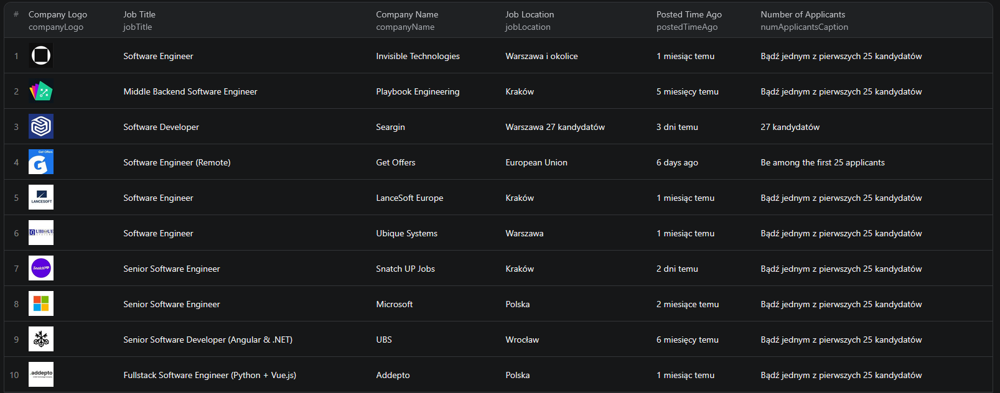

# How to Scrape LinkedIn Job Details in Node.js

This example shows how to scrape LinkedIn job details in Node.js using the [LinkedIn Job Details Scraper](https://apify.com/piotrv1001/linkedin-job-details-scraper) actor on Apify. Instead of building a scraper from scratch, you call a ready-made actor via the Apify API client — no browser automation, no HTML parsing.



## What this example does

- Takes one or more LinkedIn job posting URLs as input
- Calls the Apify actor and waits for the run to finish
- Fetches the results from the actor's dataset
- Prints each job record to the console

## Prerequisites

- [Node.js](https://nodejs.org/) v18 or higher
- An [Apify account](https://console.apify.com/)
- Your [Apify API token](https://console.apify.com/settings/integrations)

## Installation

```bash
npm install
```

## Environment setup

Copy `.env.example` to `.env` and add your Apify API token:

```bash
cp .env.example .env
```

Then edit `.env`:

```env
APIFY_TOKEN=your_apify_token_here
```

## Usage

```bash
npm start
```

## Code example

```js
import { ApifyClient } from 'apify-client';
import 'dotenv/config';

// Initialize the ApifyClient with your Apify API token
// Set APIFY_TOKEN in your .env file (copy .env.example to get started)
const client = new ApifyClient({
    token: process.env.APIFY_TOKEN,
});

// Prepare Actor input
const input = {
    "searchUrls": [
        "https://www.linkedin.com/jobs/view/4165274290"
    ]
};

// Run the Actor and wait for it to finish
const run = await client.actor("piotrv1001/linkedin-job-details-scraper").call(input);

// Fetch and print Actor results from the run's dataset (if any)
console.log('Results from dataset');
console.log(`💾 Check your data here: https://console.apify.com/storage/datasets/${run.defaultDatasetId}`);
const { items } = await client.dataset(run.defaultDatasetId).listItems();
items.forEach((item) => {
    console.dir(item);
});

// 📚 Want to learn more 📖? Go to → https://docs.apify.com/api/client/js/docs
```

## Example output

See [`sample-output.json`](./sample-output.json) for a full example. Each job record contains:

- `jobTitle` — the job title
- `companyName` — hiring company name
- `companyLogo` — URL of the company's logo image
- `jobLocation` — city, region, and country
- `postedTimeAgo` — relative posting time (e.g. "6 days ago")
- `numApplicantsCaption` — number of applicants (e.g. "33 applicants")
- `description` — full job description text
- `criteria` — structured metadata: seniority level, employment type, job function, industry
- `similarJobs` — list of related job postings LinkedIn surfaces on the page
- `peopleAlsoViewed` — other jobs viewed by candidates who viewed this listing

## Use cases

- **Job market research** — track which skills and titles are in demand across companies or regions
- **Competitive intelligence** — monitor hiring trends at specific companies or in specific industries
- **Salary and seniority benchmarking** — aggregate job criteria data to compare levels across employers
- **Recruitment tooling** — enrich your ATS or internal tools with structured LinkedIn job data
- **Job alert automation** — scrape and filter job postings on a schedule to surface the most relevant ones

## Try the actor on Apify

**[Open the LinkedIn Job Details Scraper on Apify](https://apify.com/piotrv1001/linkedin-job-details-scraper)**

## Related resources

- [How to Scrape LinkedIn Job Listings and Hiring Companies](https://www.falconscrape.com/blog/how-to-scrape-linkedin-job-listings-and-hiring-companies) — blog post with a deeper dive into LinkedIn scraping

## License

MIT
